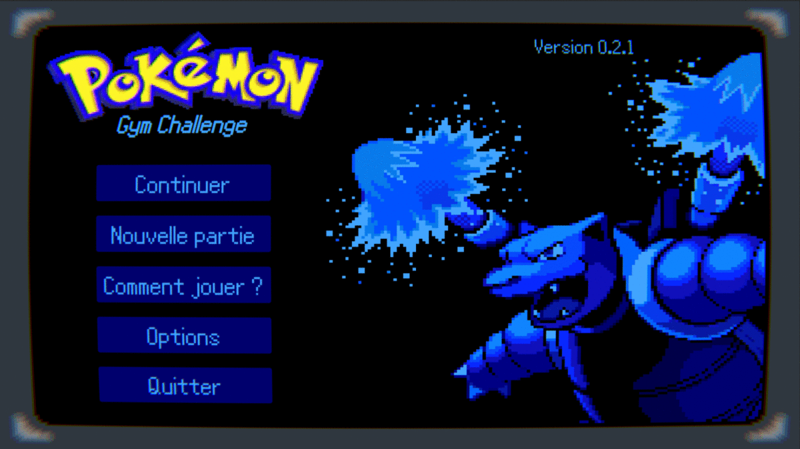
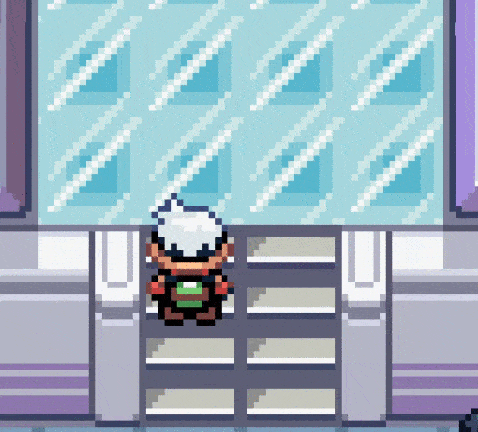

# 
<ins>Pokemon Gym Challenge</ins>

   

   

# Concept

Pokemon Gym Challenge est un jeu de puzzle dans l'univers de Pokemon. Le joueur devra atteindre la fin de chaque arène en résolvant des puzzles pour débloquer de nouvelles capacités, ce qui lui permettra d'avoir accès à de nouvelles arènes. 

Le monde se veut semi-ouvert comme dans la série originale. Le joueur devra donc avancer dans sa progression des arènes pour atteindre de nouvelles zones jusqu'alors inaccesibles. 

Vous pouvez tester le jeu directement [ici](https://l0ux.itch.io/pokemon-gym-challenge) !

# Feature

Actuellement en version **0.2.1** une seule arène est développée.   
* Mécanique de glace
    * sol qui se casse sous vos pas
    * mur de glace qui disparait si le puzzle est réalisé
    
* Personnage non joueur 
    * Actions disponnibles   
        * Texte ambiant 
        * Déplacement dans une direction ou aléatoire
        * Détection de la proximité du joueur
        * Attendre
* Dialogue simple avec un personnage non joueur 
    * Possibilité d'avoir une ligne de dialogue si on lui a déjà parlé une première fois
* Téléporteur
* keybinding
  

# Technique 

Le jeu est réalisé avec Unity 3D sous la version **2021.1.0b11**.  
J'utilise le nouveau systeme d'[Input d'Unity](https://docs.unity3d.com/Packages/com.unity.inputsystem@1.0/manual/QuickStartGuide.html).  
Tous les sprites proviennent de [The Spriters Resource](https://www.spriters-resource.com/) tandis que les audios proviennent de [pokeemerald github](https://github.com/pret/pokeemerald).

